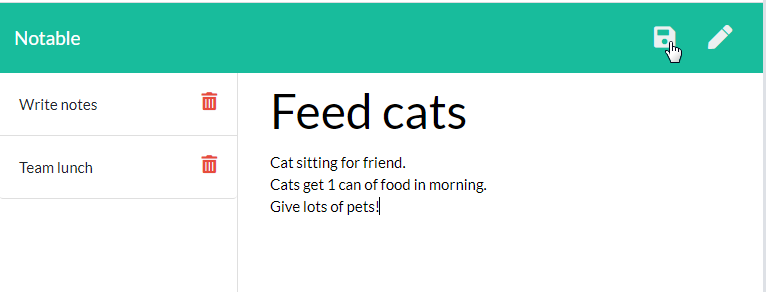

# notable


## Description

An express-based note taking application. Stores persistent notes to be accessed at any time.

This application was built to showcase use of express.js and file serving on a deployed system.

-----

## Table of Contents

* [Installation](#installation)
* [Usage](#usage)
* [License](#license)
* [Questions](#questions)


-----

## Installation

Install with ``` npm i ```

## Usage

#### Server start-up

To boot up the server, run ```npm start```.

#### Application use

Create a new note by clicking the stylus icon in the upper right. Start typing below to enter the title and body of the note. Click the disk icon to save the note. Once notes are created, they cannot currently be edited.

Load a note by clicking the note title on the left side of the page.

Delete a note by clicking the red trash icon next to the title.



-----


## Links

[GitHub repository](https://github.com/Athear/notable)

[Live application](https://note-taker-hw11-tm.herokuapp.com/notes)


  ## License

  Licensed under the [MIT](https://spdx.org/licenses/MIT.html) license.


## Questions

For additional questions, find me on [GitHub](https://github.com/athear) or email me at toddomalone@gmail.com.

